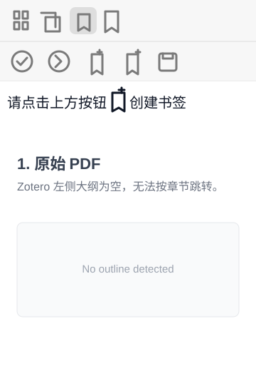
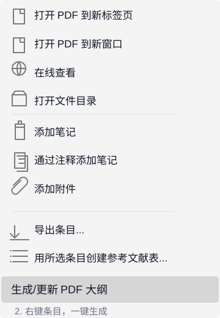
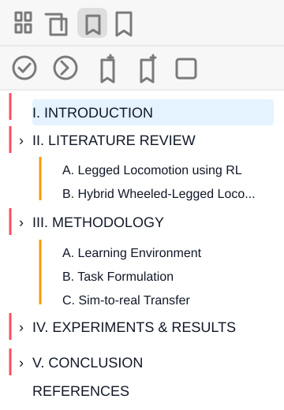

# Zotero PDF Outline Builder

Generate PDF bookmarks/outlines for papers whose PDF outline panel is empty in Zotero.

## What It Does

| 1. Empty outline | 2. Generate from Zotero | 3. Outline appears |
| --- | --- | --- |
|  |  |  |

Right-click one or more Zotero items, run `生成/更新 PDF 大纲`, and the plugin writes standard PDF bookmarks back into the attachment. Zotero's reader can then show and jump through the generated outline.

This project contains:

- a Python/PyMuPDF heading detection engine
- a drag-and-drop local debug UI
- a Zotero 9 plugin
- a Windows-only release build that bundles the engine as `outline-helper.exe`

## No AI API Required

Outline detection is powered by local Python/PyMuPDF layout analysis and rule-based heuristics. It does not call an AI model, and you do not need to provide any API key or cloud service token.

## Zotero Plugin

The plugin adds a Zotero item context-menu command:

```text
生成/更新 PDF 大纲
```

It works on:

- a selected Zotero item with PDF attachments
- a selected PDF attachment
- multiple selected items/attachments

The generated outline is written into the PDF itself as standard PDF bookmarks, so Zotero's reader and other PDF readers can use it.

## Windows Release Build

From the project root:

```bat
BUILD_WINDOWS_RELEASE.bat
```

This builds:

```text
dist/release/zotero-pdf-outline-builder-windows-v0.1.2.xpi
dist/release/updates.json
```

The release XPI bundles:

```text
native/win/outline-helper.exe
```

Users do not need Python installed.

The release manifest points to:

```text
https://github.com/xfl031129/zotero-pdf-outline-builder
```

## Development Build

For local Zotero debugging with your current Python environment:

```bat
BUILD_ZOTERO_PLUGIN.bat
```

This builds:

```text
dist/pdf-outline-builder-for-zotero.xpi
```

The development XPI points to your local `.venv`, `src`, and helper script. Do not publish the development XPI.

## CLI / Debug UI

Create the environment:

```powershell
python -m venv .venv
.\.venv\Scripts\pip install -e .
```

Dry-run a PDF:

```powershell
.\.venv\Scripts\python -m zotero_pdf_outline_builder "paper.pdf" --dry-run --force --min-confidence 0.30
```

Launch the local web debugger:

```bat
LAUNCH_DEBUG_UI.bat
```

Then drop a PDF into the browser page to generate:

- `*.outlined.pdf`
- `*.debug.pdf`

## Heuristics

The detector currently handles common cases in academic PDFs:

- existing PDF outlines
- printed tables of contents
- numbered headings, Roman headings, and lettered subsections
- two-column reading order
- wrapped multi-line headings
- figure/table/author-bio/reference false-positive filtering
- PDFs with odd text extraction such as `II` being extracted as `IL`

This is not OCR. Scanned PDFs need OCR first.

## Limitations

PDF layouts vary a lot across publishers and paper templates, so the generated outline can occasionally miss headings or include a wrong entry. If that happens, please open a GitHub issue with the PDF or a screenshot of the incorrect outline, plus a short note about what should have been detected.

## License

MIT
